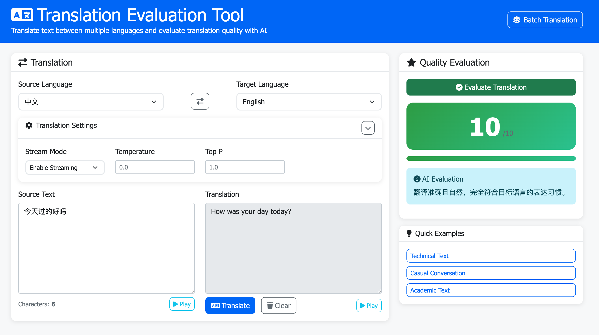
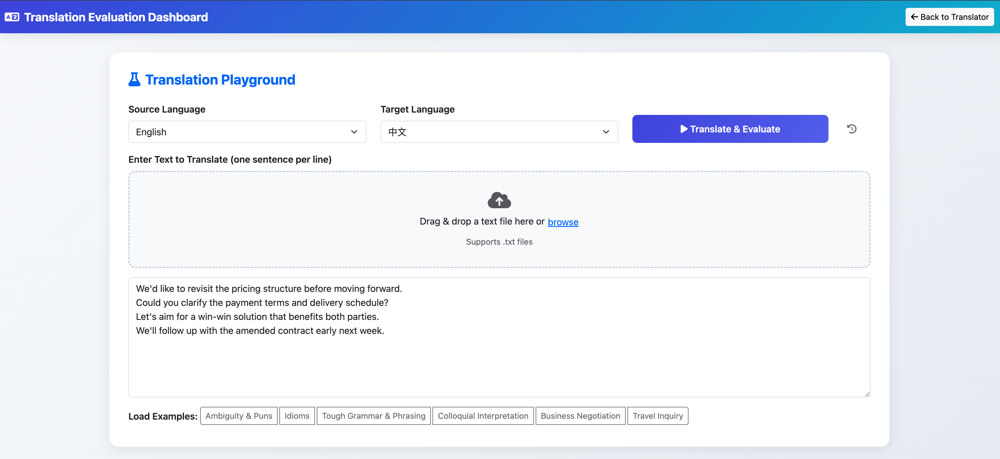
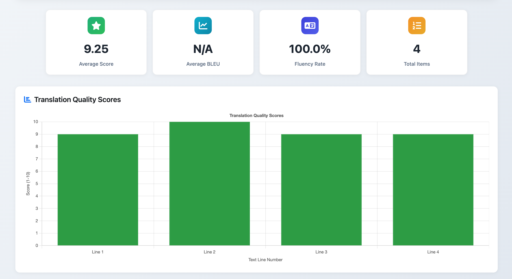
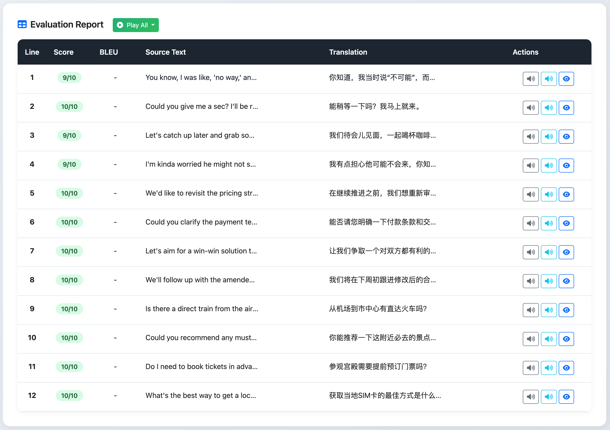
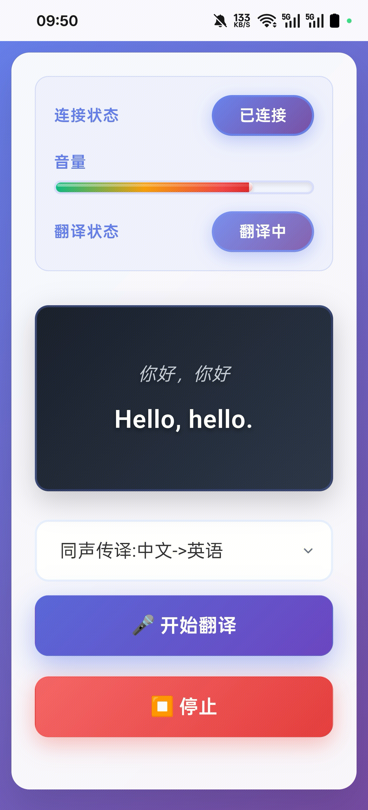

# Translation Evaluation Tool

A modern, open-source platform for multilingual translation, evaluation, and TTS synthesis. All translation and evaluation are powered by AI Large Language Models (LLMs). Supports real-time translation, intelligent evaluation, batch processing, and audio synthesis with a user-friendly web interface.

## Screenshots

Below are some key UI pages to give you a quick feel of the Translation Evaluation Tool in action.

| Translation Playground | Batch Translation & Evaluation | Evaluation Dashboard |
|---|---|---|
|  |  |  |

| Evaluation Report | Mobile Simultaneous Interpretation |
|---|---|
|  |  |

## Features

- 🌐 **Multilingual Translation (AI LLM-based)**: Translate between major languages using state-of-the-art LLMs
- 🤖 **Automatic Language Detection**
- ⚖️ **Multi-Model Translation Comparison**: Compare translations from up to 6 different AI models side-by-side
- 🚀 **Batch Translation & Evaluation**: Process multiple texts concurrently with intelligent queuing and progress tracking
- 📊 **AI-powered Evaluation (LLM-based)**: Semantic accuracy, BLEU, fluency, and overall score
- 🎵 **Text-to-Speech (TTS)**: MiniMax T2A V2 API integration
- 🖥️ **Modern Web UI**: Playground, file upload, history, and statistics
- 📦 **API-first Design**: Easy integration for developers

### Multi-Model Comparison Features

- **Side-by-Side Comparison**: Compare outputs from 2-6 AI models simultaneously
- **Parallel Processing**: All models translate concurrently for optimal performance
- **Model Selection**: Choose from configured models with user-friendly names
- **Error Handling**: Failed translations are clearly marked while successful ones are displayed
- **Easy Copy**: One-click copying of translation results
- **Responsive Design**: Optimized for various screen sizes

### Multi-Model Comparison Usage
1. Set up the environment variables in `.env` file according to [MULTI_MODEL_CONFIG.md](docs/MULTI_MODEL_CONFIG.md)
2. Run the app: `python run_app.py`
3. Open your browser at [http://127.0.0.1:8888](http://127.0.0.1:8888)
4. Click "Multi-Model Compare" to access the comparison interface

**New Features:**
- **12 Model Support**: Compare up to 12 different translation models simultaneously
- **Hunyuan Translation**: Built-in support for Tencent's Hunyuan translation service
- **Multi-Judge Evaluation**: Get scores from up to 2 different AI evaluators
- **Enhanced UI**: Beautiful, responsive interface with improved model cards and evaluation displays

### Batch Processing Features

- **Concurrent Processing**: Up to 10 simultaneous translation/evaluation tasks
- **Progress Tracking**: Real-time progress updates and completion status
- **File Upload Support**: Upload .txt files for batch processing
- **Result Export**: Download translation and evaluation results
- **History Management**: Track and review all batch operations
- **Error Handling**: Robust error recovery and retry mechanisms

### Supported Languages

- 🇺🇸 English (`en`)
- 🇨🇳 Chinese (`zh`)
- 🇯🇵 Japanese (`ja`)
- 🇧🇷 Portuguese (`pt`)
- 🇪🇸 Spanish (`es`)
- 🇫🇷 French (`fr`)
- 🇩🇪 German (`de`)
- 🇮🇹 Italian (`it`)
- 🇰🇷 Korean (`ko`)
- 🇷🇺 Russian (`ru`)
- 🇳🇱 Dutch (`nl`)
- 🇸🇪 Swedish (`sv`)
- 🇳🇴 Norwegian (`no`)
- 🇩🇰 Danish (`da`)
- 🇫🇮 Finnish (`fi`)
- 🇵🇱 Polish (`pl`)
- 🇨🇿 Czech (`cs`)
- 🇭🇺 Hungarian (`hu`)
- 🇹🇷 Turkish (`tr`)
- 🇦🇷 Arabic (`ar`)

240 translation directions are supported between these languages.

## Quick Start

### Requirements
- Python 3.8+
- pip

### Installation

```bash
git clone https://github.com/chicogong/translate_eval
cd translate_eval
python -m venv venv
source venv/bin/activate  # On Windows: venv\Scripts\activate
pip install -r requirements.txt
```

### Configuration
Set the following environment variables (in your shell or a `.env` file):

```bash
# Required for translation (AI LLM)
TRANSLATION_API_KEY=your_translation_api_key
TRANSLATION_API_URL=https://api.openai.com/v1/chat/completions
TRANSLATION_MODEL=gpt-4

# Required for evaluation (AI LLM)
EVALUATION_API_KEY=your_evaluation_api_key
EVALUATION_API_URL=https://api.openai.com/v1/chat/completions
EVALUATION_MODEL=gpt-4

# Optional for TTS
MINIMAX_API_KEY=your_minimax_api_key
MINIMAX_GROUP_ID=your_minimax_group_id
# Optional: custom port
FLASK_PORT=8888
```

### Run the App

```bash
# Development (default: http://127.0.0.1:8888)
python run_app.py

# Production
FLASK_ENV=production FLASK_HOST=0.0.0.0 python run_app.py
```

Open your browser at [http://127.0.0.1:8888](http://127.0.0.1:8888)

## API Overview

See [API_DOCS.md](docs/API_DOCS.md) for full details.

- `POST /api/translate` — Translate text (AI LLM)
- `POST /api/evaluate` — Evaluate translation (AI LLM)
- `POST /api/tts` — Text-to-speech synthesis
- `GET /api/history` — Translation & evaluation history
- `POST /api/batch-translate` — Start batch translation
- `POST /api/batch-evaluate` — Start batch evaluation
- `GET /api/available-runs` — Get available batch runs
- `GET /api/evaluation-results` — Get batch evaluation results

## Project Structure

```
translate_eval/
├── backend/           # Backend Flask app & services
│   ├── app.py
│   ├── batch.py
│   ├── config.py
│   ├── services.py
│   ├── tts_service.py
│   ├── utils.py
│   ├── examples.py
│   ├── templates/
│   └── static/
├── scripts/           # Test runner
├── tests/             # Unit tests
├── data/              # Translation/evaluation data
├── evaluation/        # Evaluation scripts
├── logs/              # Log files
├── Dockerfile         # Docker build config
├── requirements.txt
├── run_app.py         # App launcher
└── API_DOCS.md        # API documentation
```

## Contributing

Contributions are welcome! Please open issues or pull requests to help improve this project.

## Contact

For questions, feedback, or commercial inquiries, please reach out to <chicogong@tencent.com>.

## License

MIT License. See [LICENSE](LICENSE) for details.